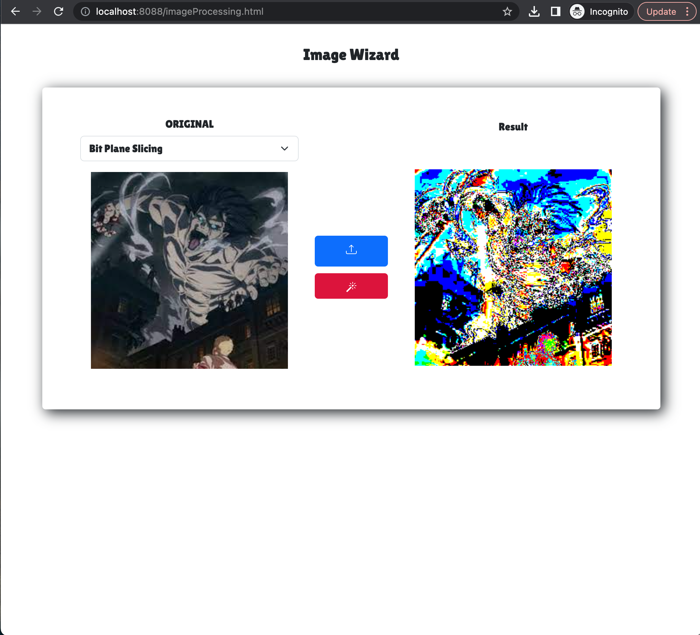
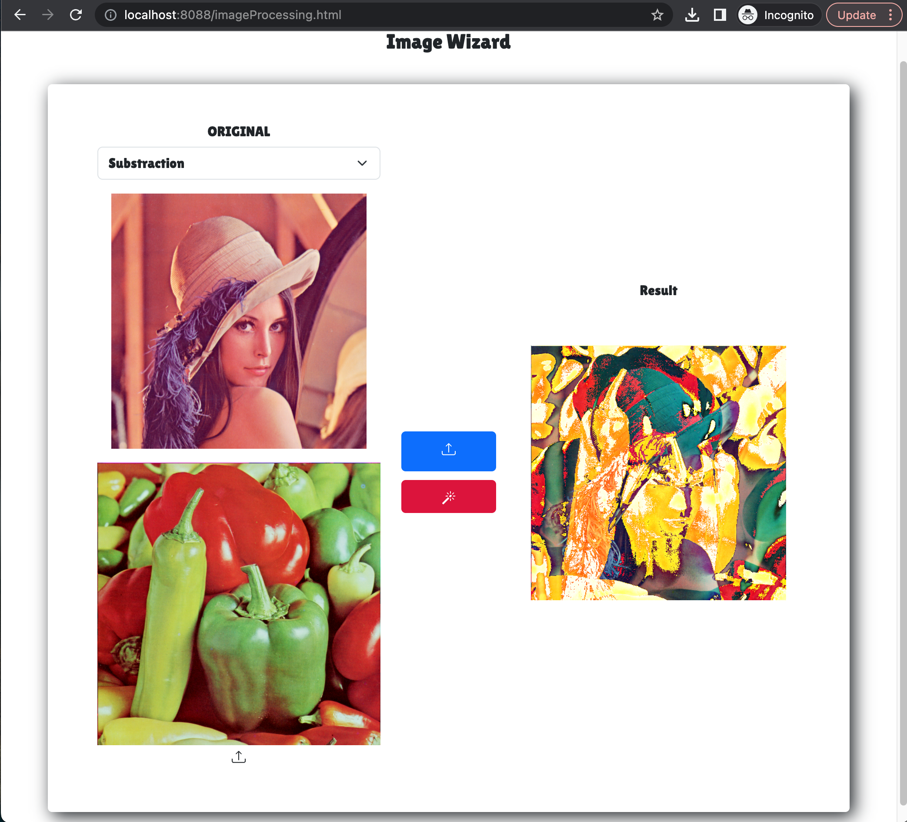

# ImageProcessing Demo

This web app is an image processing tool.
The frontend is built using: HTML, JS, Jquery and CSS.
The backend is built using Java SpringBoot. 

The frontend communicates with the backend via AJAX calls to a REST API.

Initially this project was not a web app but a desktop application built using Java AWT and Java Swing.
I decided to refactor it because why not? It's fun. 

The pixel values of the images are stored in 3D matrices representing the Red (R), Green (G), and Blue (B) channels.

The Web app supports loading images in various formats, including BMP, JPG, and PNG. Once loaded, the images can undergo processing using a selection of 26 different image processing algorithms. Some examples of these algorithms include Bit Plane Slicing, Negative Transformation, Arithmetic Operations, Convolution with various masks, and more.

After processing, the resulting images can be saved by right clicking on them.

<b>Here's a demo</b> 
 

<b>More examples...</b> 

