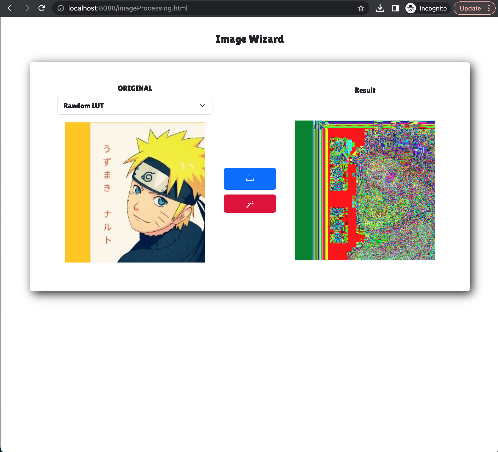

# ImageProcessing Demo

Image Processing software with GUI developed in Java using Java Awt and Java Swing.
Images are loaded using ImageIO.read and stored in a BufferedImage arrayList. Images(pixel values) are stored in 3D matrices(R, G, B).

The program allows to load images with the following formats: bmp, jpg and png.
Loaded images can be processed applying 25 different Image processing algorithms, for example: Bit plane slicing, Negative, Arithmetic operations, convolutions with several masks etc.

For arithmetic operations, bitwise operations and function transformations the images wanted to be processed can be specified in the terminal.

Processed images can be saved by pressing the selecting the image format.

<b>Here's a demo</b> 
 

<b>More examples..</b> 

